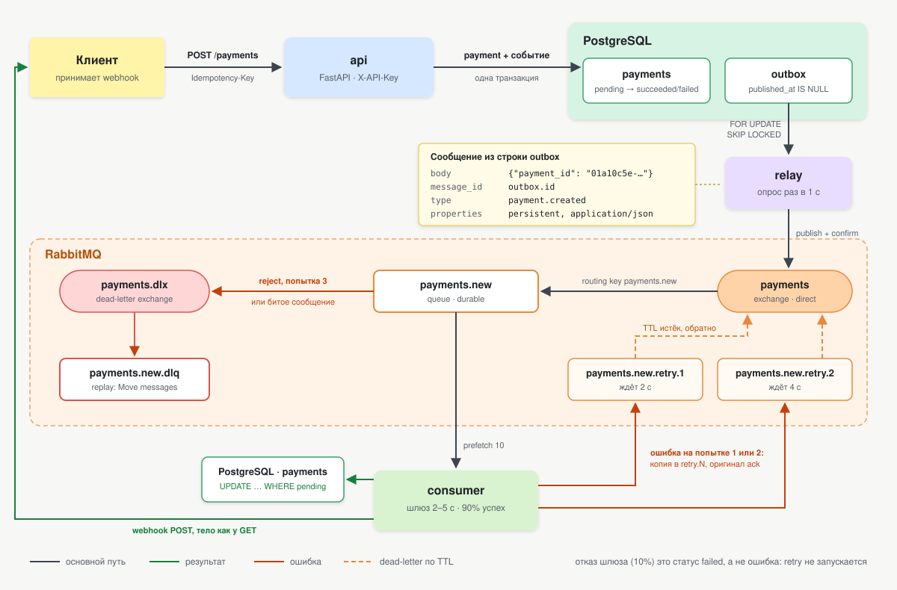
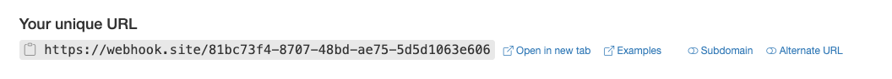
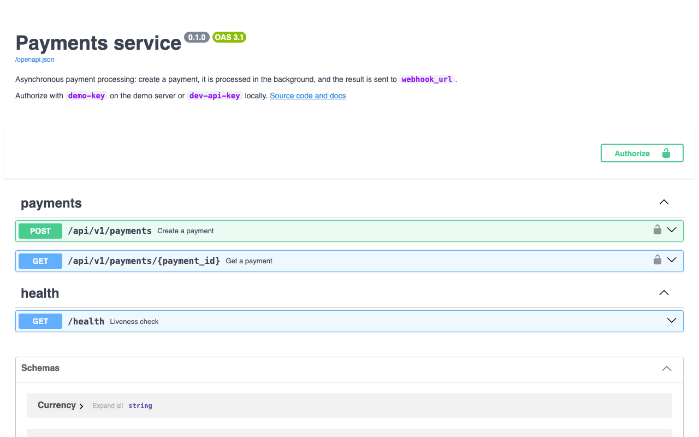
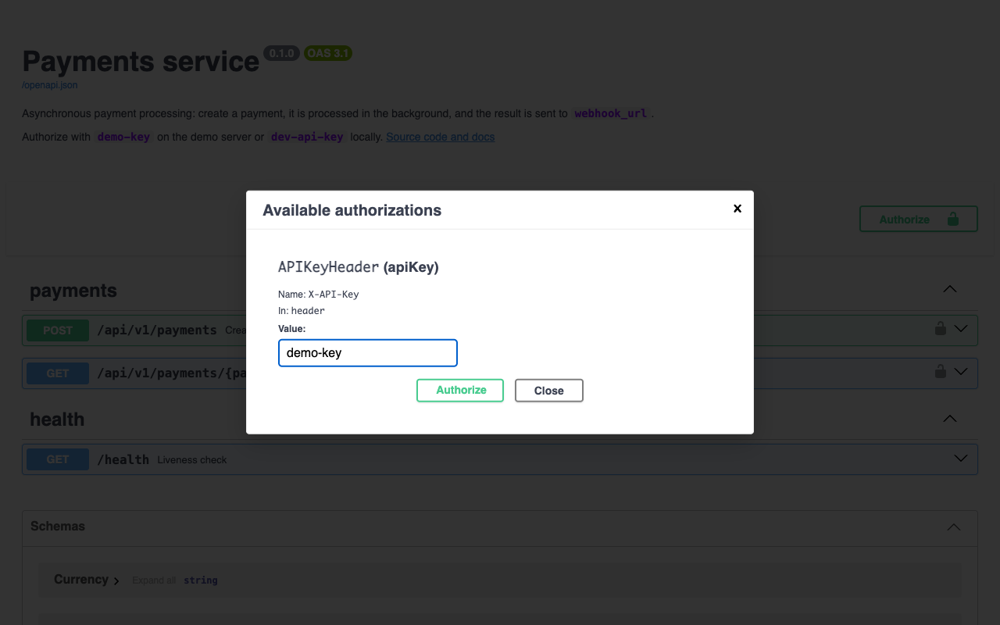
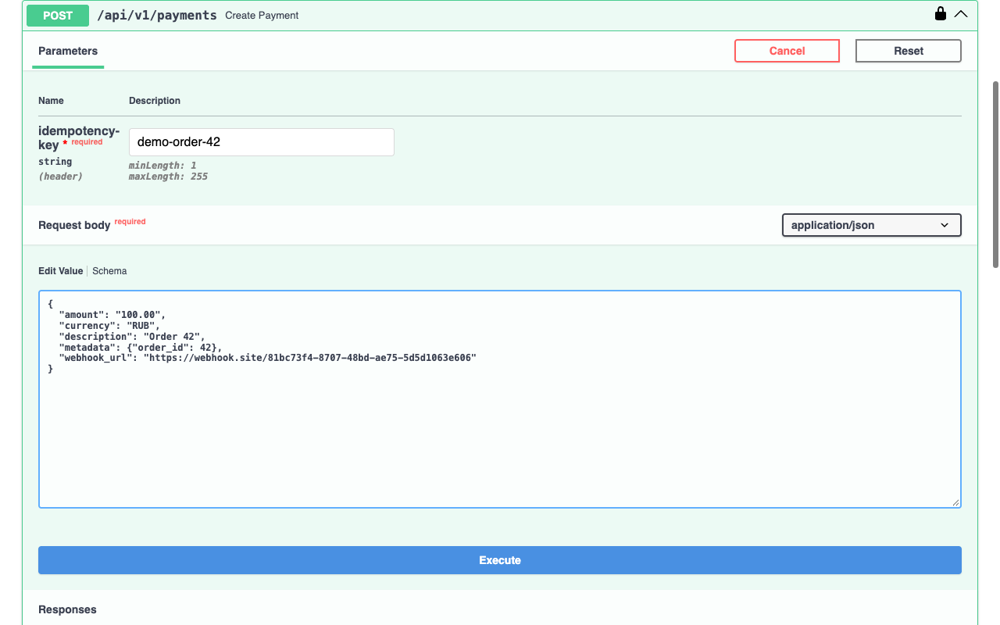
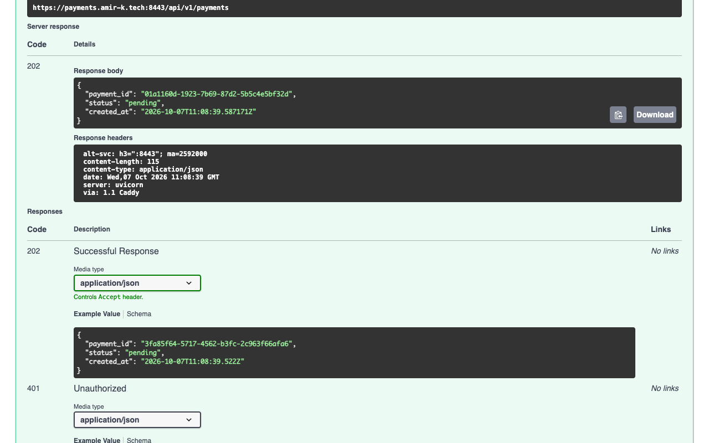
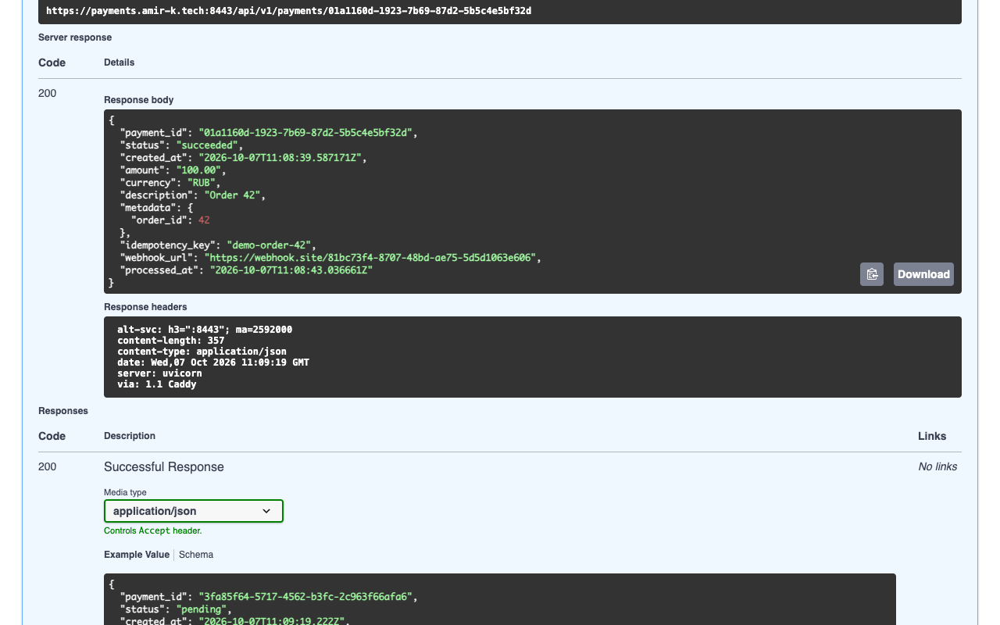
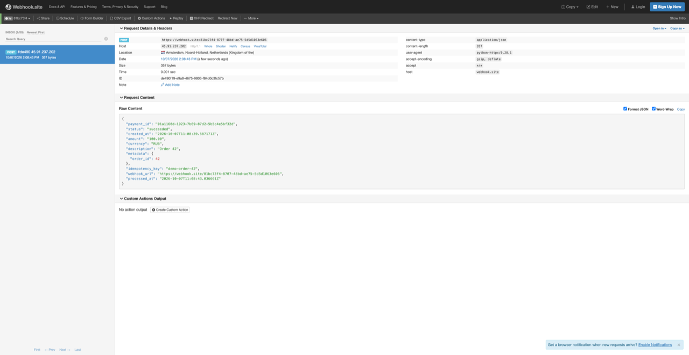

# Payments service

[](https://github.com/kentavrex/payment-processing-service/actions/workflows/ci.yml)

Асинхронный сервис процессинга платежей. Принимает запрос на оплату, обрабатывает его через эмуляцию платёжного
шлюза и сообщает клиенту результат webhook'ом.

FastAPI + Pydantic v2, SQLAlchemy 2.0 (async), PostgreSQL, RabbitMQ (FastStream), Alembic, Docker.

## Как это работает



Сервисы в compose: `postgres`, `rabbitmq`, `migrate` (применяет миграции и завершается), `api`, `relay`,
`consumer` и `webhook-echo`. Последний это заглушка, которая изображает клиента: принимает webhook'и и печатает их
в лог целиком. К сервису она не относится и нужна только для демо (см. «Безопасность»).

- **Outbox.** API в одной транзакции пишет платёж и событие в таблицу `outbox`. Отдельный процесс `relay`
  публикует неопубликованные события в RabbitMQ (`FOR UPDATE SKIP LOCKED`) и помечает их. Если RabbitMQ недоступен,
  платежи всё равно принимаются, события копятся в outbox и уходят, когда брокер вернётся.
- **Идемпотентность.** `Idempotency-Key` защищён unique-индексом, гонку решает `INSERT ... ON CONFLICT DO NOTHING`.
  Повтор с тем же телом возвращает тот же платёж, с другим телом даёт 422.
- **Consumer** обрабатывает платёж, пишет статус и шлёт webhook. Повторная доставка сообщения безопасна: платёж с
  финальным статусом не уходит в шлюз повторно, а только переотправляет webhook.
- **Retry и DLQ.** Если обработка упала (чаще всего webhook недоступен), сообщение уходит в retry-очередь и
  по истечении паузы возвращается в `payments.new`. Пауза растёт экспоненциально: 2 с, 4 с. После третьей неудачной
  попытки сообщение попадает в `payments.new.dlq`.

Отказ шлюза (10% платежей) это не ошибка обработки: платёж получает статус `failed`, клиент получает webhook, retry
не запускается. Retry и DLQ нужны для технических сбоев.

## Демо

Сервис развёрнут: **https://payments.amir-k.tech:8443/docs**. Ключ API для демо публичный: `demo-key`. Деньги
ненастоящие, данные могут периодически очищаться.

**1. Возьмите адрес для webhook'а.** Откройте [webhook.site](https://webhook.site): он сразу выдаст уникальный адрес,
у каждого свой. На него сервис пришлёт результат платежа.



**2. Откройте Swagger** и нажмите **Authorize**.



**3. Введите ключ** `demo-key`, нажмите **Authorize**, затем **Close**. Замки у эндпоинтов закроются.



**4. Создайте платёж.** Раскройте `POST /api/v1/payments`, нажмите **Try it out**, впишите любой `idempotency-key`
и тело запроса с адресом из шага 1 в `webhook_url`, нажмите **Execute**.

```json
{
  "amount": "100.00",
  "currency": "RUB",
  "description": "Order 42",
  "metadata": {"order_id": 42},
  "webhook_url": "https://webhook.site/<ваш-id>"
}
```



**5. Сервис отвечает `202 Accepted`** со статусом `pending`: платёж принят и обрабатывается асинхронно. Повторите
запрос с тем же `idempotency-key`, и придёт тот же `payment_id`, второго платежа не будет.



**6. Через 2–5 секунд проверьте статус.** В `GET /api/v1/payments/{payment_id}` вставьте `payment_id` из ответа.
Статус уже финальный: `succeeded` или, примерно в 10% случаев, `failed`, плюс заполнен `processed_at`.



**7. Webhook пришёл.** На webhook.site появился POST от сервиса с тем же телом, что и у ответа GET.



То же самое из терминала:

```bash
curl -X POST https://payments.amir-k.tech:8443/api/v1/payments \
  -H 'X-API-Key: demo-key' -H "Idempotency-Key: $(uuidgen)" -H 'Content-Type: application/json' \
  -d '{"amount": "100.00", "currency": "RUB", "webhook_url": "https://webhook.site/<ваш-id>"}'
```

Внутренние адреса в `webhook_url` сервис отклоняет (см. «Безопасность»).

## Структура кода

```
app/
├── api/            уровень API: HTTP-роуты, проверка X-API-Key, сессия на запрос
├── messaging/      тот же уровень для RabbitMQ: топология, relay, consumer с retry и DLQ
├── services/       бизнес-логика: идемпотентное создание платежа, обработка, webhook
├── database/       уровень данных: модели, сессия, все запросы к БД в repository.py
├── schemas.py      контракт: тела запросов и ответов API, тело webhook'а
├── config.py
└── main.py         FastAPI-приложение
```

Зависимости идут в одну сторону: `api` и `messaging` вызывают `services`, `services` вызывают `database`. В сервисах нет
SQL, в `database` нет бизнес-правил, сервисы не знают про HTTP и RabbitMQ. Relay обращается к `database` напрямую: он только
доставляет события из outbox и бизнес-правил не содержит.

## Запуск

```bash
make up
```

Без `make` то же самое: `docker compose up --build`.

- API: http://localhost:8000 (Swagger: http://localhost:8000/docs)
- RabbitMQ UI: http://localhost:15672 (`payments` / `payments`)

Ключ API по умолчанию `dev-api-key`. Менять настройки можно через `.env` (шаблон в `.env.example`).

| Команда | Что делает |
|---|---|
| `make up` | собирает образы и поднимает весь стек |
| `make down` | останавливает стек и удаляет данные |
| `make test` | поднимает postgres и rabbitmq, ждёт их готовности, запускает тесты |
| `make lint` | `ruff check`, проверка форматирования и `mypy` |
| `make format` | автоисправления ruff и форматирование |

## Примеры

Создать платёж. Заголовки `X-API-Key` и `Idempotency-Key` обязательны:

```bash
curl -i -X POST localhost:8000/api/v1/payments \
  -H 'X-API-Key: dev-api-key' -H 'Idempotency-Key: demo-1' -H 'Content-Type: application/json' \
  -d '{"amount": "100.00", "currency": "RUB", "description": "Order 42",
       "metadata": {"order_id": 42}, "webhook_url": "http://webhook-echo:8080/hook"}'
```

```
HTTP/1.1 202 Accepted
{"payment_id":"01a10c5e-c4ed-78fe-8f79-e2b18e3da500","status":"pending","created_at":"2026-10-05T14:01:39.820491Z"}
```

Повторить тот же запрос: придёт тот же `payment_id`, второго платежа не будет. Тот же ключ с другим телом даёт 422.

Через 2–5 секунд проверить результат:

```bash
curl -s localhost:8000/api/v1/payments/<payment_id> -H 'X-API-Key: dev-api-key'
docker compose logs webhook-echo     # webhook глазами клиента, заглушка печатает его целиком
docker compose logs -f consumer      # обработка и попытки
```

### Сценарий с DLQ

`webhook_url` ведёт в никуда, поэтому доставка падает три раза:

```bash
curl -s -X POST localhost:8000/api/v1/payments \
  -H 'X-API-Key: dev-api-key' -H 'Idempotency-Key: demo-dlq' -H 'Content-Type: application/json' \
  -d '{"amount": "5.00", "currency": "USD", "webhook_url": "http://unreachable.invalid/hook"}'
docker compose logs -f consumer
```

В логе consumer видны три попытки с паузами 2 с и 4 с, затем сообщение лежит в `payments.new.dlq`
(RabbitMQ UI → Queues). Статус платежа при этом уже финальный: упала только доставка webhook'а.

**Вернуть сообщение из DLQ:** RabbitMQ UI → Queues → `payments.new.dlq` → Move messages → destination
`payments.new`. Делать это стоит после устранения причины. Сообщение сохраняет счётчик попыток, поэтому после
возврата у него одна попытка: если причина не устранена, оно снова окажется в DLQ, ничего не потеряв.

## Конфигурация

Переменные окружения (значения по умолчанию в скобках):

| Переменная | Назначение |
|---|---|
| `DATABASE_URL`, `RABBITMQ_URL`, `API_KEY` | подключения и статический ключ для `X-API-Key` (обязательные) |
| `OUTBOX_POLL_INTERVAL` (1.0) | пауза relay, когда outbox пуст, секунды |
| `OUTBOX_BATCH_SIZE` (100) | сколько событий relay публикует за раз |
| `GATEWAY_MIN_DELAY`, `GATEWAY_MAX_DELAY` (2.0, 5.0) | время обработки в эмуляции шлюза |
| `GATEWAY_SUCCESS_RATE` (0.9) | доля успешных платежей |
| `MAX_ATTEMPTS` (3) | всего попыток обработки, включая первую |
| `RETRY_BASE_DELAY` (2.0) | пауза перед попыткой N+1 равна `base * 2^(N-1)` |
| `WEBHOOK_TIMEOUT` (5.0) | таймаут отправки webhook'а |
| `CONSUMER_PREFETCH` (10) | сколько платежей один consumer обрабатывает одновременно |
| `WEBHOOK_ALLOW_PRIVATE_NETWORKS` (false) | разрешить webhook на внутренние адреса; локальный compose включает его для `webhook-echo` |

Consumer масштабируется: `docker compose up --scale consumer=3`.

## Деплой на сервер

Прод-вариант добавляет к `docker-compose.yml` файл `docker-compose.production.yml`:

- Caddy перед API: сам получает сертификат Let's Encrypt через порт 80 и отдаёт HTTPS на порту 8443 (443 на целевом
  сервере занят другим сервисом, поэтому проверка домена через 443 отключена), с 80 редиректит на 8443;
- обязательный `API_KEY` из `.env` вместо `dev-api-key`;
- проверка SSRF включена, `webhook-echo` не запускается.

На сервере с Docker и `docker compose`, после того как A-запись домена указывает на сервер:

```bash
git clone https://github.com/kentavrex/payment-processing-service.git /opt/payments
cd /opt/payments
cat > .env <<EOF
DOMAIN=payments.amir-k.tech
API_KEY=$(openssl rand -hex 32)
POSTGRES_PASSWORD=$(openssl rand -hex 16)
RABBITMQ_PASSWORD=$(openssl rand -hex 16)
EOF
docker compose -f docker-compose.yml -f docker-compose.production.yml up -d --build
```

Swagger: `https://payments.amir-k.tech:8443/docs`. Ключ API лежит в `.env` на сервере. Postgres, RabbitMQ и его UI
слушают только `127.0.0.1` сервера, UI доступен через SSH-туннель: `ssh -L 15672:localhost:15672 <сервер>`.

Обновить уже развёрнутый сервис:

```bash
git fetch && git reset --hard origin/main
docker compose -f docker-compose.yml -f docker-compose.production.yml up -d --build
```

## Разработка и тесты

Нужен [uv](https://docs.astral.sh/uv/).

```bash
make test
make lint
```

Без `make`. Тестам нужны postgres и rabbitmq (с management на 15672) из compose:

```bash
docker compose up -d --wait postgres rabbitmq
uv sync
uv run pytest
uv run ruff check . && uv run ruff format --check . && uv run mypy app tests
```

Тесты используют отдельную базу `payments_test` и vhost `payments_test` в RabbitMQ, поэтому не пересекаются с
запущенным стеком. Миграции в тестах применяются настоящие, и один из тестов проверяет, что модели совпадают с
миграциями. Тесты брокера идут на настоящем RabbitMQ, включая цепочку retry → DLQ.

### CI

GitHub Actions ([`.github/workflows/ci.yml`](.github/workflows/ci.yml)) запускается на каждый push в `main` и на
pull request. Три джоба идут параллельно:

| Джоб | Что проверяет |
|---|---|
| `lint` | `ruff check`, `ruff format --check`, `mypy` |
| `test` | весь `pytest` на настоящих postgres и rabbitmq (service-контейнеры) |
| `end-to-end` | поднимает весь стек из `docker-compose.yml`, создаёт платёж через API и ждёт финальный статус и webhook в `webhook-echo` |

Новый push в ту же ветку отменяет прогон, который ещё идёт.

## Принятые решения и компромиссы

- **At-least-once.** Между БД и брокером нет общей транзакции, поэтому relay может опубликовать событие повторно
  (например, упал после публикации, но до коммита), а webhook может прийти дважды. Consumer идемпотентен, клиенту
  нужно дедуплицировать webhook'и по `payment_id` и `status`.
- **Три попытки это три попытки в сумме**: первая сразу и два повтора с паузами 2 с и 4 с. Значение настраивается
  через `MAX_ATTEMPTS`.
- **Любой ответ webhook'а не 2xx считается неудачей и ретраится**, включая 4xx. 404 бывает временным (клиент
  деплоится), а 429 ретраить нужно в любом случае.
- **Пауза retry держит RabbitMQ, а не процесс.** Для каждой попытки своя очередь с TTL сообщения и dead-letter
  обратно в `payments.new`. Consumer не спит, ожидающие повторы переживают его перезапуск. Библиотеки вроде
  `tenacity` ретраят внутри процесса и дали бы второй слой повторов поверх этого.
- **Очереди classic.** На одном узле надёжность та же, что у quorum. В проде стоило бы использовать quorum
  с `x-dead-letter-strategy: at-least-once`.
- **Relay опрашивает outbox раз в секунду**, а не слушает `LISTEN/NOTIFY`. Задержка до секунды на фоне 2–5 с
  обработки не важна, а опрос идёт по частичному индексу и почти ничего не стоит. Батч публикуется последовательно,
  при росте нагрузки это можно распараллелить.
- **Шлюз вызывается без блокировки платежа.** Если два дубля сообщения обработаются одновременно, статус запишет
  первый (`UPDATE ... WHERE status = 'pending'`), второй отправит webhook с уже записанным статусом. Шлюз при этом
  дёрнется дважды: настоящему шлюзу передавали бы `payment_id` как ключ идемпотентности.
- **`/health` не пишется в access log.** Его раз в 10 секунд дёргает healthcheck compose, и без фильтра эти строки
  забивали бы лог запросов к API.
- **Строки outbox не удаляются.** В проде нужна очистка по расписанию или партиционирование.

## Безопасность

- **В логах сервиса нет данных платежа.** api, relay и consumer пишут только идентификаторы: `payment_id`,
  `message_id` события, номер попытки, код ответа webhook'а. Сумма, описание, metadata, `Idempotency-Key` и
  `webhook_url` в лог не попадают. URL скрыт и в ошибках: клиенты часто кладут в него токен, поэтому ошибка
  доставки содержит только код ответа (`webhook responded 500`). Это закреплено тестом.
- **`webhook-echo` печатает платёж целиком, потому что изображает клиента.** Заглушка получает webhook на свой адрес
  так же, как его получил бы клиент, и показывает, что именно ему пришло. Частью сервиса она не является, в проде
  её нет.
- **Аутентификация.** Статический ключ в `X-API-Key` на всех эндпоинтах `/api/v1`, сравнение за постоянное время
  (`secrets.compare_digest`). Клиент без ключа получает 401 раньше валидации тела и не видит схему. `/health`,
  `/docs` и `/openapi.json` открыты.
- **Входные данные** проверяются до записи в БД: сумма больше нуля и не больше двух знаков после запятой, валюта из
  списка, `webhook_url` только `http`/`https`, неизвестные поля запрещены, длина описания и `Idempotency-Key`
  ограничена, `metadata` не больше 16 КБ в JSON. Общий размер тела запроса в проде ограничивает reverse proxy.
- **Защита от SSRF.** Перед отправкой webhook'а consumer резолвит хост и отказывает, если хотя бы один адрес не
  публичный: loopback, приватные сети, link-local (включая `169.254.169.254` с метаданными облака), CGNAT. Локальный
  compose отключает проверку флагом `WEBHOOK_ALLOW_PRIVATE_NETWORKS`, потому что заглушка живёт во внутренней сети,
  прод-конфиг включает её обратно. Между проверкой и запросом DNS может смениться (DNS rebinding), полную защиту даёт
  egress-прокси.
- **Контейнеры** работают под непривилегированным пользователем, порты проброшены только на `127.0.0.1`. Пароли и
  ключ по умолчанию (`payments`, `dev-api-key`) нужны для локального запуска, в проде их задают через `.env`.

Что нужно добавить для прода:

- **Подпись webhook'а.** Тело не подписано, клиент не может проверить отправителя. Нужна HMAC-подпись в заголовке.
- **Ключ на клиента.** Сейчас ключ один, и любой его владелец видит любой платёж. В multi-tenant варианте нужны
  `client_id`, свой ключ у каждого клиента и проверка владельца при чтении.
- **Rate limit** на уровне ingress или API gateway.
